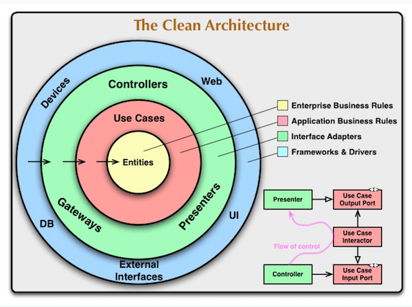
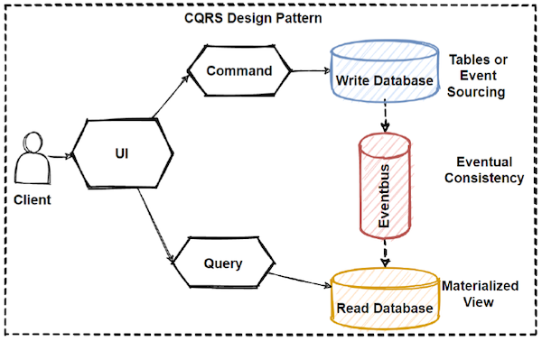

# Contacts store
This is a very basic contacts store used as a training project to highlight architectures principles
- CLEAN architecture on [main](https://github.com/davidterranova/contacts/tree/main) branch
- CQRS on [cqrs](https://github.com/davidterranova/contacts/tree/cqrs) branch

## WARNING
The store is not thread safe and in-memory

# Highlights
- Stateless presenters API: easily scalable, no session management
- Free from storage constraints: SQL, NoSQL, in-memory, ...
- Clean architecture: cost effective, maintainable, testable, free from framework, with a clear separation of concerns and layers dependencies order
  
  
- CQRS principles: Commqnd Query Responsibility Segregation
  
  
- SOLID
  - Single responsibility principle: each layer has a single responsibility
  - Open/closed principle: each layer is open for extension but closed for modification
  - Liskov substitution principle: each layer can be replaced by another one without breaking the system
  - Interface segregation principle: each layer has its own interface
  - Dependency inversion principle: each layer depends on abstraction, not on concretions

# Run

```
go run main.go server
```

# Dev install

## Protobuff
Install protobuff (OSX)

https://github.com/protocolbuffers/protobuf

```
brew install protobuf
go install google.golang.org/protobuf/cmd/protoc-gen-go@latest
go install google.golang.org/grpc/cmd/protoc-gen-go-grpc@v1.2
export PATH="$PATH:$(go env GOPATH)/bin"
```
